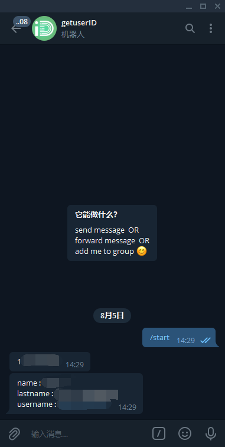
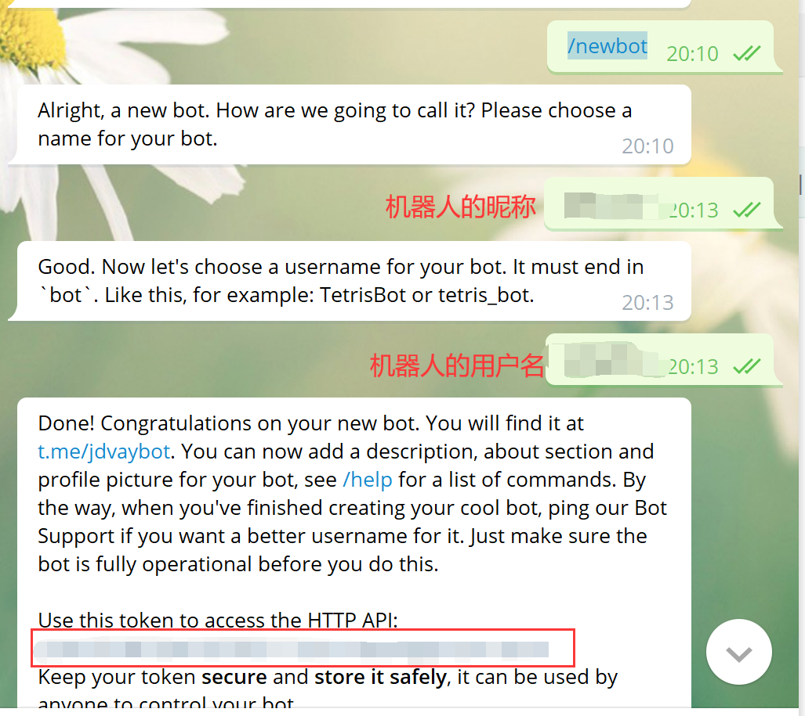
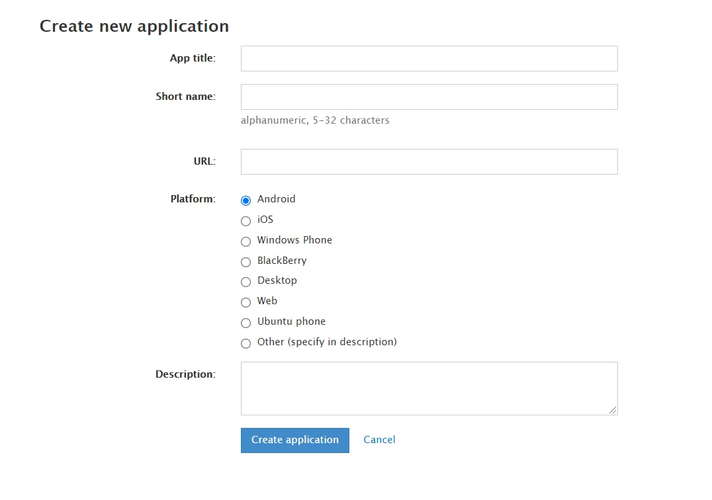
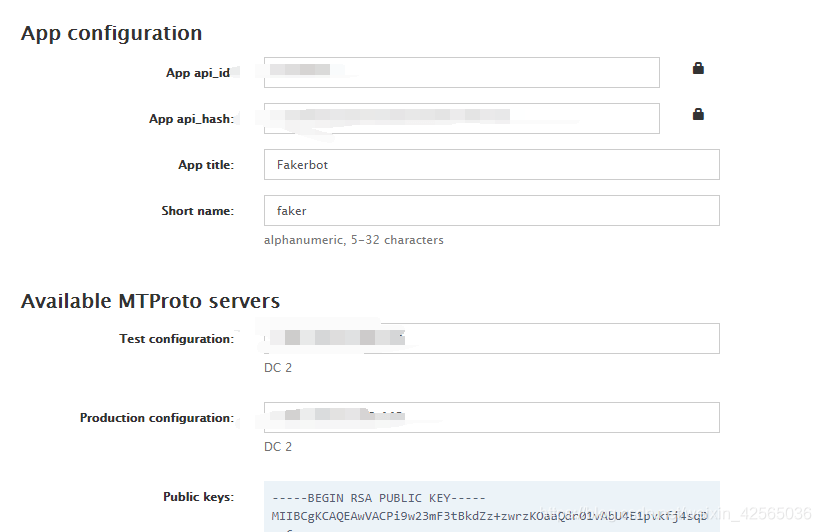
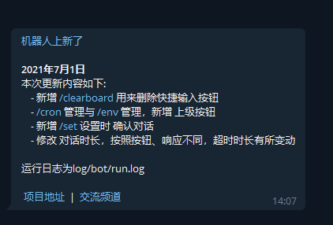

# <a href="https://telegram.org"></a> __Telegram Bot__

- 编辑位于 **config** 目录下的 **bot.json** 配置文件
> 面板编辑入口：编辑配置 - 机器人配置

```json
{
    "//": "//开头的的都是注释，不要动，剩下的都按要求改自己的",
    "//user_id": "↓↓↓  你的USERID，去除双引号  ↓↓↓",
    "user_id": 123456789,
    "//bot_token": "↓↓↓  你的机器人TOKEN  ↓↓↓",
    "bot_token": "123456789:ABCDEFGSHSFDASDFAD",
    "//api_id": "↓↓↓  https://my.telegram.org 在该网站申请到的id  ↓↓↓",
    "api_id": "456423156",
    "//api_hash": "↓↓↓  https://my.telegram.org 在该网站申请到的hash  ↓↓↓",
    "api_hash": "ASDFAWEFADSFAWEFDSFASFD",
    "//proxy": "↓↓↓  使用代理改成true，不使用下方带proxy的不用动  ↓↓↓",
    "proxy": false,
    "//proxy_type": "↓↓↓  socks5 或者 http 或者 MTProxy ↓↓↓",
    "proxy_type": "socks5",
    "//proxy_add": "↓↓↓  代理IP地址例如：192.168.99.100  ↓↓↓",
    "proxy_add": "192.168.99.100",
    "//proxy_port": "↓↓↓  代理端口，不需要双引号例如 5890  ↓↓↓",
    "proxy_port": 5890,
    "//proxy_secret": "↓↓↓  如果使用MTProxy，填入MTProxy代理秘钥  ↓↓↓",
    "proxy_secret": "",
    "//proxy_user": "↓↓↓  代理的username,有就改，没有就不要动  ↓↓↓",
    "proxy_user": "代理的username,有则填写，无则不用动",
    "//proxy_password": "↓↓↓  代理的密码,有则填写，无则不用动  ↓↓↓",
    "proxy_password": "代理的密码,有则填写，无则不用动",
    "//StartCMD": "↓↓↓ 是否开启CMD命令，开启改成true  ↓↓↓",
    "StartCMD": false,
    "//noretry": "↓↓↓ 是否 关闭 bot掉线重连，默认开启，关闭改成true  ↓↓↓",
    "noretry": false
}
```

  ?> 必须至少正确配置前 `4` 个关键参数才可以使用

  > 下面是配置教程👇

***

## 1. 获取账号 ID

- 打开 Telegram 搜索 `@getuseridbot` 或[点击此处](https://t.me/getuseridbot)前往，输入 `/start` 获取，如图



## 2. 创建 BOT

- 打开 Telegram 搜索 `@BotFather` 或[点击此处](https://t.me/BotFather)前往，输入 `/newbot` 按提示创建一个新的 Bot



?> 如图，将获取到的 `bot_token` 填入 **bot.json** 中

## 3. 获取 API
- 使用美国节点打开网址 [https://my.telegram.org](https://my.telegram.org/)，输入您注册 Telegrame 时的手机号进行登录
- 点击登陆后会给您的 Telegram 账号发送一条含有验证码的消息(不是短信)，登陆后点击 `API development tools` ，随意瞎填即可



- 下面是创建完的截图，将获取到的 `api_id` 和 `api_hash` 填入 **bot.json** 完成配置



- 服务启动后如果网络正常，那么会自动给你发送一条消息表明已经建立了连接，如图




***

## 代理设置 <!-- {docsify-ignore} -->
> 如果容器环境本身不支持访问外网那么需要配合代理才能使用，`MTProxy` 代理是坏的无法使用，推荐使用 `Socks5`\
> `Socks5` 代理特征明显容易被墙，**强烈建议**配合 **IP限制策略** 使用，即配置服务端口仅允许您设备的流量通过，限制后会非常稳定

- 一台位于境外的服务器，通过 CLI 一键启动 **Socks5** 代理容器

```bash
docker run -d -p <自定义端口号>:1080 \
-e PROXY_USER=<自定义用户名> \
-e PROXY_PASSWORD=<自定义密码> \
-e PROXY_SERVER=0.0.0.0:1080 \
--name socks5 \
--restart always \
xkuma/socks5
```

- 分别对应

```json
{
  "proxy": true,
  "proxy_type": "socks5",
  "proxy_add": "<你的服务器IP地址>",
  "proxy_port": <你的端口号>,
  "proxy_user": "<你的用户名>",
  "proxy_password": "<你的密码>",
}
