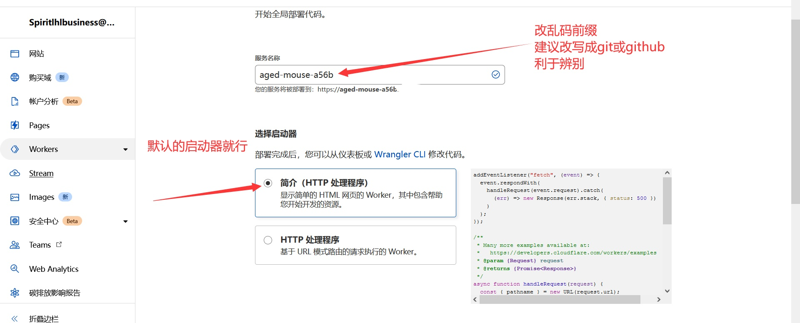

> 我们鼓励大家使用自建代理来访问 [GitHub](https://github.com) 以减轻公共代理服务器的流量压力，因为那些作者都在用爱发电

> 这里只介绍基于 [CloudFlare Workers](https://workers.cloudflare.com/) 的免费代理，部署简单并且可以完全白嫖，[CloudFlare](https://www.cloudflare.com/zh-cn) 是一家国际知名的CDN服务商

?> 建议使用**夜间主题**(右上角)查看本页内容

***

## 注册 CloudFlare
?> 如果已有注册账号则忽略该步骤，直接创建

> 注册链接：https://dash.cloudflare.com/sign-up

> 可能部分地区官网访问较慢，注册账号需要邮件验证

## 创建 Worker

- ### 1. 进入面板点击创建服务 <!-- {docsify-ignore} -->


- ### 2. 自行定义网站前缀名 <!-- {docsify-ignore} -->




- ### 3. 创建后点击快速编辑 <!-- {docsify-ignore} -->


- ### 4. 复制粘贴下面的代码，覆盖原有代码 <!-- {docsify-ignore} -->

```javascript
'use strict'

/**
 * static files (404.html, sw.js, conf.js)
 */
const ASSET_URL = 'https://github.com/'
// 前缀，如果自定义路由为example.com/gh/*，将PREFIX改为 '/gh/'，注意，少一个杠都会错！
const PREFIX = '/'
// git使用cnpmjs镜像、分支文件使用jsDelivr镜像的开关，0为关闭，默认开启
const Config = {
    jsdelivr: 1,
    cnpmjs: 1
}

/** @type {RequestInit} */
const PREFLIGHT_INIT = {
    status: 204,
    headers: new Headers({
        'access-control-allow-origin': '*',
        'access-control-allow-methods': 'GET,POST,PUT,PATCH,TRACE,DELETE,HEAD,OPTIONS',
        'access-control-max-age': '1728000',
    }),
}

const exp1 = /^(?:https?:\/\/)?github\.com\/.+?\/.+?\/(?:releases|archive)\/.*$/i
const exp2 = /^(?:https?:\/\/)?github\.com\/.+?\/.+?\/(?:blob|raw)\/.*$/i
const exp3 = /^(?:https?:\/\/)?github\.com\/.+?\/.+?\/(?:info|git-).*$/i
const exp4 = /^(?:https?:\/\/)?raw\.(?:githubusercontent|github)\.com\/.+?\/.+?\/.+?\/.+$/i
const exp5 = /^(?:https?:\/\/)?gist\.(?:githubusercontent|github)\.com\/.+?\/.+?\/.+$/i

/**
 * @param {any} body
 * @param {number} status
 * @param {Object<string, string>} headers
 */
function makeRes(body, status = 200, headers = {}) {
    headers['access-control-allow-origin'] = '*'
    return new Response(body, {status, headers})
}

/**
 * @param {string} urlStr
 */
function newUrl(urlStr) {
    try {
        return new URL(urlStr)
    } catch (err) {
        return null
    }
}

addEventListener('fetch', e => {
    const ret = fetchHandler(e)
        .catch(err => makeRes('cfworker error:\n' + err.stack, 502))
    e.respondWith(ret)
})

function checkUrl(u) {
    for (let i of [exp1, exp2, exp3, exp4, exp5, ]) {
        if (u.search(i) === 0) {
            return true
        }
    }
    return false
}

/**
 * @param {FetchEvent} e
 */
async function fetchHandler(e) {
    const req = e.request
    const urlStr = req.url
    const urlObj = new URL(urlStr)
    let path = urlObj.searchParams.get('q')
    if (path) {
        return Response.redirect('https://' + urlObj.host + PREFIX + path, 301)
    }
    // cfworker 会把路径中的 `//` 合并成 `/`
    path = urlObj.href.substr(urlObj.origin.length + PREFIX.length).replace(/^https?:\/+/, 'https://')
    if (path.search(exp1) === 0 || path.search(exp5) === 0 || !Config.cnpmjs && (path.search(exp3) === 0 || path.search(exp4) === 0)) {
        return httpHandler(req, path)
    } else if (path.search(exp2) === 0) {
        if (Config.jsdelivr) {
            const newUrl = path.replace('/blob/', '@').replace(/^(?:https?:\/\/)?github\.com/, 'https://cdn.jsdelivr.net/gh')
            return Response.redirect(newUrl, 302)
        } else {
            path = path.replace('/blob/', '/raw/')
            return httpHandler(req, path)
        }
    } else if (path.search(exp3) === 0) {
        const newUrl = path.replace(/^(?:https?:\/\/)?github\.com/, 'https://github.com.cnpmjs.org')
        return Response.redirect(newUrl, 302)
    } else if (path.search(exp4) === 0) {
        const newUrl = path.replace(/(?<=com\/.+?\/.+?)\/(.+?\/)/, '@$1').replace(/^(?:https?:\/\/)?raw\.(?:githubusercontent|github)\.com/, 'https://cdn.jsdelivr.net/gh')
        return Response.redirect(newUrl, 302)
    } else {
        return fetch(ASSET_URL + path)
    }
}

/**
 * @param {Request} req
 * @param {string} pathname
 */
function httpHandler(req, pathname) {
    const reqHdrRaw = req.headers

    // preflight
    if (req.method === 'OPTIONS' &&
        reqHdrRaw.has('access-control-request-headers')
    ) {
        return new Response(null, PREFLIGHT_INIT)
    }

    const reqHdrNew = new Headers(reqHdrRaw)

    let urlStr = pathname
    if (urlStr.startsWith('github')) {
        urlStr = 'https://' + urlStr
    }
    const urlObj = newUrl(urlStr)

    /** @type {RequestInit} */
    const reqInit = {
        method: req.method,
        headers: reqHdrNew,
        redirect: 'manual',
        body: req.body
    }
    return proxy(urlObj, reqInit)
}

/**
 *
 * @param {URL} urlObj
 * @param {RequestInit} reqInit
 */
async function proxy(urlObj, reqInit) {
    const res = await fetch(urlObj.href, reqInit)
    const resHdrOld = res.headers
    const resHdrNew = new Headers(resHdrOld)

    const status = res.status

    if (resHdrNew.has('location')) {
        let _location = resHdrNew.get('location')
        if (checkUrl(_location))
            resHdrNew.set('location', PREFIX + _location)
        else {
            reqInit.redirect = 'follow'
            return proxy(newUrl(_location), reqInit)
        }
    }
    resHdrNew.set('access-control-expose-headers', '*')
    resHdrNew.set('access-control-allow-origin', '*')

    resHdrNew.delete('content-security-policy')
    resHdrNew.delete('content-security-policy-report-only')
    resHdrNew.delete('clear-site-data')

    return new Response(res.body, {
        status,
        headers: resHdrNew,
    })
}
```


- ### 5. 测试请求是否反代成功 <!-- {docsify-ignore} -->


- ### 6. 保存并部署 <!-- {docsify-ignore} -->


> 然后就可以使用了，你的代理是 `https://<服务名>.<用户名>.workers.dev/`，可以直接用于 [USER_PROXY_URL](../install/%E9%83%A8%E7%BD%B2%E9%A1%B9%E7%9B%AE?id=%e7%8e%af%e5%a2%83%e5%8f%98%e9%87%8f)

***

## 如何为已部署的容器设置代理
> 宿主机终端操作

- 1. 进入相关目录
```bash
cd /var/lib/docker/containers/$(docker inspect --format='{{.Id}}' jd)
```
> 容器名默认为 `jd` ，如果不是则自行修改

- 2. 定义代理地址
```bash
PROXY_TMP="https://<你的地址>/"
```
!> 这里需要输入你的代理地址

- 3. 一键修改配置文件
```bash
sed -i "s/\"Env\":\[\"/\"Env\":\[\"USER_PROXY_URL=$(echo ${PROXY_TMP} | sed "s#\/#\\\/#g; s#\.#\\\.#g")\",\"/g" config.v2.json
```

- 4. 重启 Docker 服务
```bash
systemctl daemon-reload
systemctl restart docker
```
> 注意此操作会重启容器